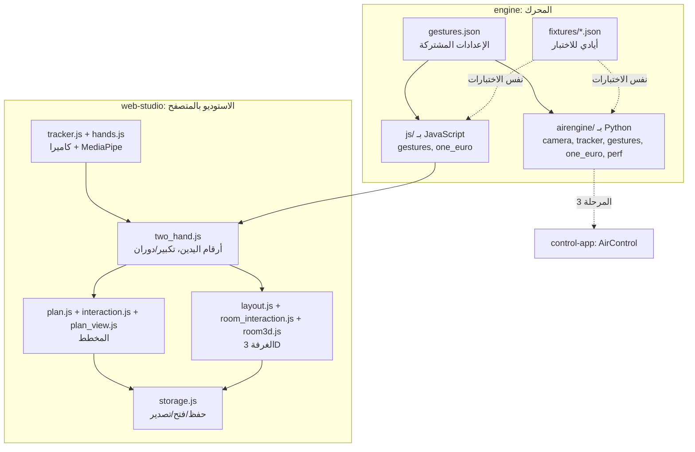

# خريطة المشروع

```mermaid
flowchart TD
    subgraph ENGINE[engine: المحرك]
      CFG[gestures.json<br/>الإعدادات المشتركة]
      FIX[fixtures/*.json<br/>أيادي للاختبار]
      PY[airengine/ بـ Python<br/>camera, tracker, gestures, one_euro, perf]
      JS[js/ بـ JavaScript<br/>gestures, one_euro]
      CFG --> PY & JS
      FIX -. نفس الاختبارات .-> PY & JS
    end

    subgraph WEB[web-studio: الاستوديو بالمتصفح]
      TR[tracker.js + hands.js<br/>كاميرا + MediaPipe]
      TH[two_hand.js<br/>أرقام اليدين، تكبير/دوران]
      PLAN[plan.js + interaction.js + plan_view.js<br/>المخطط]
      ROOM[layout.js + room_interaction.js + room3d.js<br/>الغرفة 3D]
      ST[storage.js<br/>حفظ/فتح/تصدير]
      TR --> TH --> PLAN & ROOM
      PLAN & ROOM --> ST
    end

    JS --> TH
    PY -. المرحلة 3 .-> CTRL[control-app: AirControl]
```

الحالة: المرحلة 1 (المحرك) والمرحلة 2 (الاستوديو) خلصت. 70 اختبار وحدة JS + 9 اختبارات متصفح + 30 اختبار Python. التالي: المرحلة 3 (AirControl بوضع Dry-run).
