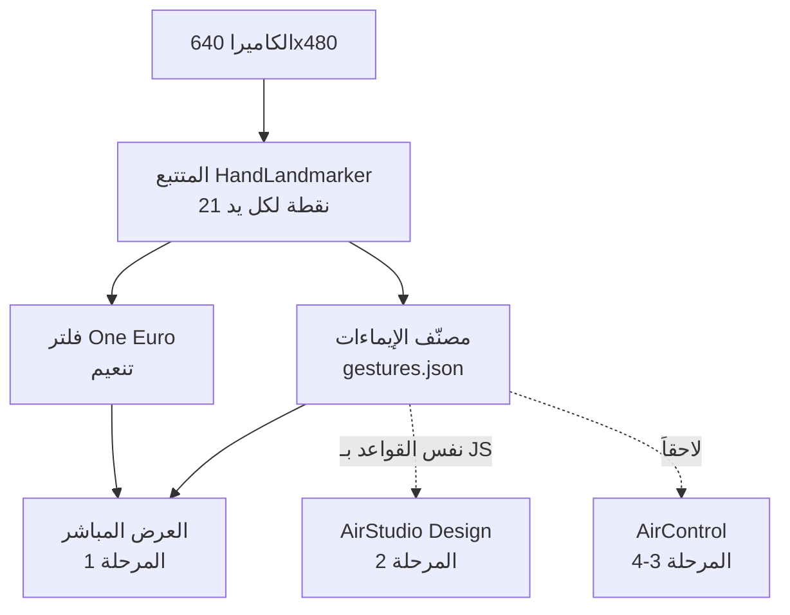

# خريطة المشروع

```mermaid
flowchart TD
    CAM[الكاميرا 640x480] --> TR[المتتبع HandLandmarker<br/>21 نقطة لكل يد]
    TR --> F[فلتر One Euro<br/>تنعيم]
    TR --> G[مصنّف الإيماءات<br/>gestures.json]
    G --> DEMO[العرض المباشر<br/>المرحلة 1]
    F --> DEMO
    G -. نفس القواعد بـ JS .-> WEB[AirStudio Design<br/>المرحلة 2]
    G -. لاحقاً .-> CTRL[AirControl<br/>المرحلة 3-4]
```

الحالة: المرحلة 1 قيد البناء.
